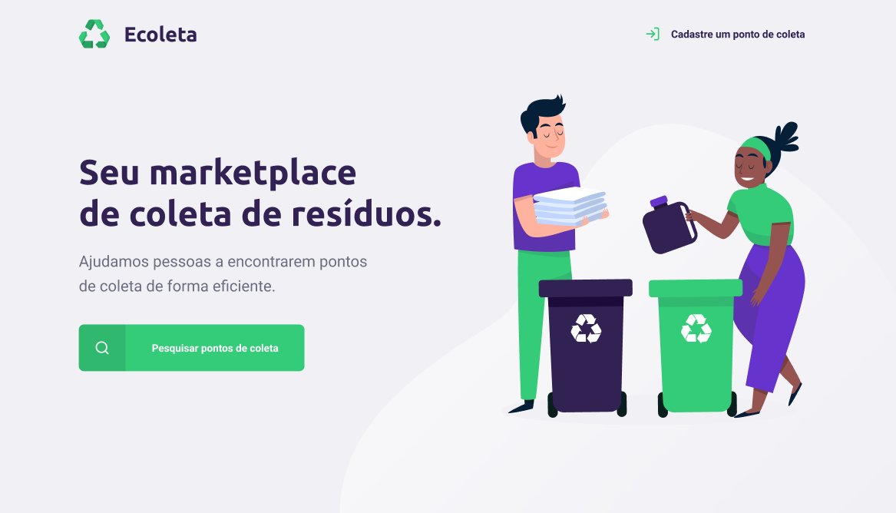

# Ecoleta # Next Level Week

Projeto desenvolvido durante a Next Level Week (1 a 7 de junho de 2020), promovido pela Rocketseat 

**Sobre a NLW** 

[https://nextlevelweek.com](https://nextlevelweek.com/)

A Next Level Week é um evento online e gratuito, com duração de uma semana, promovido pela Rocketseat para acelerar a evolução de desenvolvedores e apresentar os métodos de ensino da empresa. Esta é a primeira edição, que surgiu para substituir a Semana OmniStack, e antecipa a abertura de novas turmas para o curso Bootcamp GoStack.

O Projeto

Ecoleta é um sistema FullStack (com back-end, front-end web e mobile) de cadastramento de pontos de coleta de variados itens recicláveis, para facilitar o acesso da população e incentivar um descarte consciente.